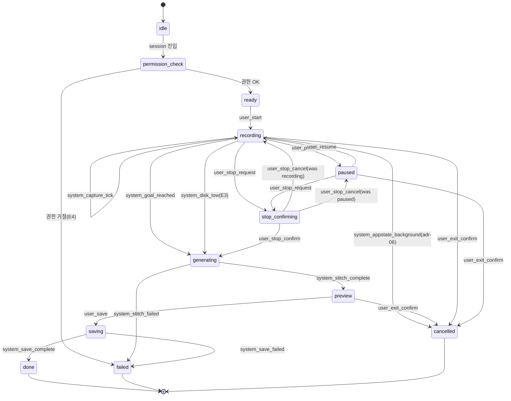

# 녹화 세션 상태머신 — 상태 전이·이벤트·실패 모드 명세

## Summary

focus → generating → preview → saving → done 전체 흐름의 상태·이벤트·실패 모드를 정의한다. 프레임 샘플링 패러다임(adr-04) + sqrt 스케줄(adr-05) + 백그라운드 정지(adr-06) + 정지 모달(adr-07) + 캐시 TTL(adr-08)을 모두 반영.

> **status: ✅ accepted** (2026-05-04 합의, 2026-05-05 D-SPEC-1-1 정정)
> - D-SPEC-1-1 = **C** (captures → preview.mp4 [오버레이 없음] + result 화면에서 **RN 오버레이 시뮬**(video timeline sync) → 사용자 옵션 선택 → burn-in stitch → final.mp4. stitch 2회)
> - D-SPEC-1-2 = **A** (모달 중 capture timer 일시정지, Z 표시 고정, 모달 cancel 시 elapsed 유지하여 재개)
> - D-SPEC-1-3 = **A** (권한 문구 영어 1종 — 본 plan 범위. 다국어는 별도 i18n plan)
> - 추가: **E1 전화 처리** = AppState `background` OR `inactive` 둘 다 정지 trigger (안전 우선, 실기기 검증은 코드 task 단계)
> - 추가: **preview.mp4 cleanup** = saving 완료 시 stitched.mp4 와 함께 즉시 삭제 (captures/ 5분 TTL 과 별개)

---

## 1. 상태 정의 (State Enum)

| 상태 | 화면 | 의미 |
|---|---|---|
| `idle` | (session-setup 직후) | 카메라 권한 확인 전. focus 화면 진입 시 자동 전이 |
| `permission_check` | focus | 카메라/마이크 권한 요청 중 |
| `ready` | focus | 권한 OK, 캡처 시작 대기 (▶ 버튼 표시) |
| `recording` | focus | 캡처 timer 작동 중. sqrt schedule에 따라 간헐 JPEG 캡처 |
| `paused` | focus | 캡처 timer 정지. ▶ 버튼으로 재개 가능 |
| `stop_confirming` | focus (모달) | 정지 확인 모달 표시 중 (adr-07). 캡처 timer 일시정지. |
| `generating` | generating | 캡처 완료, D-SPEC-1-1 결정에 따라 stitch 또는 skip |
| `preview` | result | 오버레이 옵션 선택 중. 사용자가 변경 가능. |
| `saving` | saving | 최종 burn-in stitch + 갤러리 저장 중 |
| `done` | result/next | 갤러리 저장 + 세션 PATCH 완료 |
| `failed` | (에러 화면) | 복구 불가 오류. 원인은 FailureReason enum |
| `cancelled` | (이전 화면) | 사용자 명시 취소 또는 백그라운드 강제 중단 |

---

## 2. 상태 전이 매트릭스

### 정상 흐름

| from | event | to | side effects |
|---|---|---|---|
| `idle` | (session 진입) | `permission_check` | 카메라/마이크 권한 요청 |
| `permission_check` | `system_permission_granted` | `ready` | idle timer 비활성 준비 |
| `ready` | `user_start` | `recording` | captures/ 디렉토리 생성, captureTimer 시작, **idle timer 비활성** (adr-06) |
| `recording` | `system_capture_tick` | `recording` | JPEG 한 장 write → frame_NNNNN.jpg |
| `recording` | `user_pause` | `paused` | captureTimer 일시정지 |
| `paused` | `user_resume` | `recording` | captureTimer 재개 |
| `recording` | `user_stop_request` | `stop_confirming` | captureTimer 일시정지, 모달 표시 |
| `paused` | `user_stop_request` | `stop_confirming` | 모달 표시 (timer 이미 정지) |
| `stop_confirming` | `user_stop_confirm` | `generating` | captureTimer 종료, idle timer 재활성, → spec-02 stitch 호출 |
| `stop_confirming` | `user_stop_cancel` | `recording` | captureTimer 재개 (was recording) |
| `stop_confirming` | `user_stop_cancel` | `paused` | (was paused) |
| `recording` | `system_goal_reached` | `generating` | 모달 없이 즉시 정지, captureTimer 종료 |
| `generating` | `system_stitch_complete` | `preview` | — |
| `preview` | `user_save` | `saving` | burn-in stitch 시작 |
| `saving` | `system_save_complete` | `done` | stitched.mp4 즉시 삭제, captures/ 5분 TTL 타이머 시작, 세션 PATCH |

### 에러/취소/백그라운드

| from | event | to | side effects |
|---|---|---|---|
| `permission_check` | `system_permission_denied` | `failed` | E4: 권한 거절 메시지 |
| `recording` | `system_appstate_background` | `cancelled` | captureTimer 정지, idle timer 재활성, captures/ 5분 TTL 시작, 알림 (adr-06) |
| `recording` | `system_disk_low` | `generating` | E3: 경고 후 현재 캡처 장수로 stitch 진행 |
| `recording` | `system_min_duration_violation` | `recording` | E7: 10초 미만 정지 시도 → 알림 후 recording 유지 |
| `generating` | `system_stitch_failed` | `failed` | captures/ 5분 TTL 유지 (재시도 가능) |
| `saving` | `system_save_failed` | `failed` | E6: 저장 권한 거절 또는 갤러리 오류 |
| `saving` | `system_stitch_failed` | `failed` | burn-in stitch 실패 |
| `any (except done/failed)` | `user_exit_confirm` | `cancelled` | captures/ + stitched.mp4 즉시 삭제 |

---

## 3. 트리거 / 이벤트 Enum

### 사용자 액션
| 이벤트 | 발생 조건 |
|---|---|
| `user_start` | ▶ 버튼 탭 (ready 상태) |
| `user_pause` | ⏸ 버튼 탭 (recording 중) |
| `user_resume` | ▶ 버튼 탭 (paused 상태) |
| `user_stop_request` | ⏹ 버튼 탭 → 모달 표시 트리거 |
| `user_stop_confirm` | 모달 "정지하고 타임랩스 생성" 탭 |
| `user_stop_cancel` | 모달 "계속하기" 탭 |
| `user_save` | result 화면 "Save to Gallery" 탭 |
| `user_exit_request` | ← 버튼 탭 → 취소 확인 모달 |
| `user_exit_confirm` | 취소 모달 "Leave" 탭 |
| `user_exit_cancel` | 취소 모달 "Keep Going" 탭 |

### 시스템 이벤트
| 이벤트 | 발생 조건 |
|---|---|
| `system_permission_granted` | 카메라+마이크 권한 모두 획득 |
| `system_permission_denied` | 권한 하나 이상 거절 |
| `system_capture_tick` | captureTimer 발화 (sqrt schedule t_N 도달) |
| `system_goal_reached` | elapsed ≥ goalSec |
| `system_appstate_background` | AppState → 'background'/'inactive' (adr-06) |
| `system_disk_low` | 여유 디스크 < policy-01 임계값 |
| `system_stitch_complete` | spec-02 stitchTimelapse() resolve |
| `system_stitch_failed` | spec-02 stitchTimelapse() reject |
| `system_save_complete` | MediaLibrary.saveToLibraryAsync() 완료 |
| `system_save_failed` | MediaLibrary 오류 또는 권한 거절 |
| `system_min_duration_violation` | user_stop_request 발생 시 elapsed < 10초 |

---

## 4. 캐시 Lifecycle 통합 (adr-08 연동)

| 전이 / 이벤트 | captures/ 상태 | stitched.mp4 상태 |
|---|---|---|
| ready → recording | 디렉토리 생성: `{docDir}/sessions/{sessionId}/captures/` | — |
| system_capture_tick | frame_NNNNN.jpg append | — |
| generating 진입 | 읽기 전용 (stitch 입력) | 생성 시작: stitched.mp4 |
| preview 진입 | 유지 (재stitch 대비) | 유지 |
| saving → done | 5분 TTL 타이머 시작 | **즉시 삭제** (갤러리 저장 완료 후) |
| 5분 TTL 만료 | **전체 삭제** | — |
| user_exit_confirm | **즉시 삭제** | **즉시 삭제** |
| recording → cancelled (bg) | 5분 TTL 시작 (재시도 가능) | — |
| failed (stitch) | 5분 TTL 유지 | — |
| failed (save) | 5분 TTL 유지 | 유지 (재시도 대비) |

---

## 5. 백그라운드 처리 명세 (adr-06 연동)

| 현재 상태 | 백그라운드 진입 시 동작 | 복귀 시 동작 |
|---|---|---|
| `recording` | 즉시 cancelled + captureTimer 정지 + 로컬 알림 | ready 상태. 타임랩스 생성하려면 새 세션 시작 or 5분 TTL 내 재시도 |
| `paused` | 즉시 cancelled + 로컬 알림 | 동일 |
| `generating` | 계속 진행 (백그라운드 앱 처리 허용, 카메라 미사용) | 진행 중 표시 |
| `saving` | 계속 진행 (동일) | 진행 중 표시 |
| `preview` | no-op (캡처 없음) | 그대로 유지 |
| `done` / `failed` / `cancelled` | no-op | 그대로 유지 |

**화면 잠금 시**: recording/paused → cancelled (카메라 렌즈 차단). idle timer 비활성(adr-06)으로 녹화 중 화면 꺼짐 방지 → 화면 잠금 전까지는 카메라 유지.

**E1 전화 수신**: iOS `AVAudioSession` interruption → AppState 'inactive' 전환으로 처리됨 (recording → cancelled 동일 경로).

---

## 6. 실패 모드 카탈로그

| FailureReason | 발생 시나리오 | 사용자 메시지 | 다음 행동 | 재시도 가능 |
|---|---|---|---|---|
| `permission_camera_denied` | E4 | "카메라 권한이 필요합니다. 설정 → FocusTimelapse → 카메라 허용" | 시스템 설정 이동 링크 | 설정 변경 후 재시도 |
| `permission_mic_denied` | E4 (adr-04로 마이크 불필요 — 이 케이스 자동 해소) | — | — | — |
| `disk_full_capture` | E3, 녹화 중 | "저장 공간이 부족합니다. 지금까지 녹화된 N프레임으로 타임랩스를 생성합니다." | generating 자동 전이 | 부분 결과물로 진행 |
| `stitch_failed_disk` | E3, stitch 중 | "타임랩스 생성 실패. 저장 공간을 확보 후 5분 내 다시 시도할 수 있습니다." | 뒤로가기 (5분 TTL 안) | ✅ 5분 TTL 내 |
| `stitch_failed_memory` | OOM | "타임랩스 생성 중 오류가 발생했습니다." | 뒤로가기 | ✅ 5분 TTL 내 |
| `save_permission_denied` | E6 | "갤러리 저장 권한이 필요합니다. 설정 → 사진 → 추가 허용" | 시스템 설정 이동 링크 | ✅ 권한 허용 후 |
| `save_gallery_failed` | 갤러리 API 오류 | "갤러리 저장 중 오류가 발생했습니다. 다시 시도해 주세요." | 저장 재시도 버튼 | ✅ |
| `session_api_failed` | E8 | (무시 — 로컬 완료 진행, 사용자에게 미표시 or 약한 토스트) | 로컬 완료 후 백그라운드 재시도 | — |
| `camera_unavailable` | 기기 카메라 없음 / 점유 | "카메라를 사용할 수 없습니다. 다른 앱이 카메라를 사용 중이거나 기기에 카메라가 없습니다." | 뒤로가기 | ✅ 앱 전환 후 |
| `min_duration_violation` | E7, elapsed < 10초 | "타임랩스를 생성하려면 최소 10초 이상 공부해야 합니다." | recording 유지 | — (계속 진행) |

---

## 7. 상태 다이어그램

---

## 8. 결정 필요 항목

### D-SPEC-1-1: generating 단계의 의미 (✅ 결정됨)

**슬로건: C안 채택 — preview.mp4 (오버레이 없음) + result 화면에 RN 오버레이 시뮬레이션 (video timeline sync)**

| 안 | generating 동작 | result preview | saving 동작 | stitch 횟수 |
| --- | --- | --- | --- | --- |
| A (폐기) | captures → preview.mp4 (오버레이 없음) | 동영상 재생 (오버레이 없음) | 선택 오버레이 burn-in stitch → final.mp4 | 2회 |
| B | 캡처 완료 표시만 (stitch 없음) | 첫 프레임 정지 화면 또는 이미지 슬라이드쇼 | 오버레이 burn-in stitch (첫 stitch) | 1회 |
| **C (채택)** | **captures → preview.mp4 (오버레이 없음)** | **동영상 재생 + RN `<View>/<Text>` 오버레이 시뮬 (player.currentTime sync)** | **선택 오버레이 burn-in stitch → final.mp4** | 2회 |

**채택: C** (2026-05-05 정정. 5/4 결정 A 에서 전환)

Why:
1. **WYSIWYG 진짜 보장** — A 안은 preview 에 오버레이가 없어서 사용자가 옵션 (Timer/Progress/Streak) 을 골라봐야 *결과를 미리 못 봄*. saving 누르고 갤러리 열어야 봄 = "독심술 문제".
2. RN `<View>/<Text>` 오버레이는 즉각 렌더 — 옵션 토글 시 바로 시각 변화. burn-in 비용 0.
3. timer/progress 는 video player.currentTime 폴링으로 영상 timeline 에 sync — preview 가 final 의 정확한 미리보기.
4. preview.mp4 자체는 여전히 오버레이 없음 (생성 비용 최소).
5. SSOT (`OVERLAY_LAYOUT` + `buildScaledLayout`) 가 RN 과 native burn-in 양쪽에서 동일 공식 사용 → 시각 일치 보장.

**구현**: T-021 (2026-05-05). RN 오버레이 시뮬 부활 + video timeline sync. 관련: native burn-in 도 자연 비율 logo + NSShadow blur 로 RN 과 매칭.

---

### D-SPEC-1-2: 정지 모달 중 캡처 timer 처리 (사용자 승인 필요)

**슬로건: 모달 중 timer 일시정지 권장 — 모달의 Z초 예상치가 변하지 않아야 UX 일관**

| 안          | 모달 중 captureTimer                        | 모달 cancel 후         | "Z초" 정확도                |
| ---------- | ---------------------------------------- | ------------------- | ----------------------- |
| **A (권장)** | **일시정지 (stop_confirming 상태에서 timer 멈춤)** | **재개 (elapsed 유지)** | **모달 표시 시점 고정 — 일관**    |
| B          | 계속 작동                                    | 자동 유지               | 모달 보는 동안 프레임 추가 → Z값 변동 |

**권장: A**

Why: 모달에서 "결과 약 16.7초"를 보는 사이에 캡처가 추가되면 숫자가 변동 → 사용자 혼란. timer 일시정지로 모달 표시 순간의 값을 고정. cancel 후 elapsed 그대로 재개이므로 데이터 손실 없음.

**참고**: `stop_confirming` 상태는 내부적으로 `paused` 와 동일한 timer 동작 (단 UI는 다름 — 모달 표시 vs 명시적 일시정지). 재개 시 `was_recording` flag로 원래 상태로 복원.

**승인 질문**: A(모달 중 timer 정지) vs B(계속 작동) 중 선택.

---

## 9. 시나리오 매핑

| planning-01 시나리오 | 상태머신 경로 |
|---|---|
| S1 (2시간 → 60초 → 갤러리) | recording → system_goal_reached → generating → preview → saving → done |
| S2 (목표 전 수동 정지) | recording → user_stop_request → stop_confirming → user_stop_confirm → generating → preview → saving → done |
| S3 (오버레이 변경 후 저장) | preview (overlay 선택) → saving → done |
| E1 (전화 수신) | recording → system_appstate_background → cancelled |
| E2 (백그라운드 전환) | recording → system_appstate_background → cancelled (adr-06) |
| E3 (디스크 부족) | recording → system_disk_low → generating (부분 캡처로) |
| E4 (카메라 권한 거절) | permission_check → system_permission_denied → failed |
| E5 (generating 중 강제 종료) | generating → [앱 종료] → 재진입 시 실패 안내 (state 복구 없음) |
| E6 (갤러리 저장 권한 거절) | saving → system_save_failed → failed |
| E7 (5초 미만 정지) | recording → user_stop_request + elapsed<10초 → system_min_duration_violation → recording 유지 |
| E8 (네트워크 없음) | done (세션 PATCH 실패 → 무시, 로컬 완료) |
