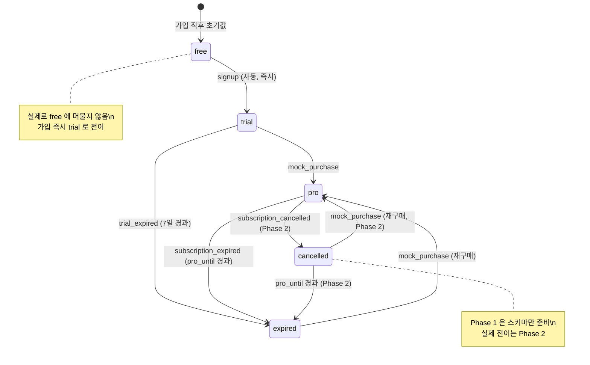

# 구독 상태 머신 — 5상태 전이 규칙·타이머·불변조건

## Summary

`free / trial / pro / expired / cancelled` 5상태 머신의 전이 규칙, 타이머/스케줄 이벤트, 불변조건, edge case 를 정밀 명세. backend @api 의 Alembic 마이그레이션 + 구독 로직 구현의 직접 입력.

---

## 1. 개요

Phase 1 구독 상태 머신은 사용자의 구독 라이프사이클을 서버 SSOT 로 관리한다. 모든 상태 전이는 서버에서 발생하며 클라이언트는 `GET /api/users/me` 로 최신 상태를 조회한다.

- Phase 1 범위: mock-purchase 기반. 스토어 SDK 없음.
- Phase 2 확장: RevenueCat webhook 이벤트를 동일 5상태로 매핑. 스키마 변경 없음.

---

## 2. 상태 정의

| 상태 | 의미 | Free 한도(1회/일) | 워터마크 | 프로그레스바 | 비고 |
|------|------|:---:|:---:|:---:|------|
| `free` | 기본 상태. 구독 없음 또는 만료 후 복귀 | ✓ 적용 | ✓ | ✗ | 신규 가입 직후 `trial` 로 즉시 전이 |
| `trial` | 7일 Pro 체험. 가입 즉시 자동 시작 | ✗ | ✗ | ✓ | `trial_start_date` 설정 |
| `pro` | 유효 구독. mock-purchase 또는 RevenueCat | ✗ | ✗ | ✓ | `pro_until` 설정 |
| `expired` | trial 7일 경과 또는 pro 구독 만료 | ✓ 적용 | ✓ | ✗ | `free` 와 동일 제한. Phase 2 RevenueCat `expired` 이벤트 매핑 |
| `cancelled` | 구독 갱신 취소 완료 (Phase 2) | 만료 전: ✗ / 만료 후: ✓ | 만료 전: ✗ / 만료 후: ✓ | 만료 전: ✓ / 만료 후: ✗ | Phase 1 에서는 `cancelled` 상태로의 전이 없음. 스키마만 준비 |

> **Pro 기능 판단**: `subscription_status IN ('trial', 'pro')` OR (`subscription_status = 'cancelled' AND pro_until > now()`)

---

## 3. 전이 다이어그램

---

## 4. 전이 규칙 표

| # | FROM | TO | 트리거 이벤트 | 트리거 조건 | Side-effect | Phase |
|---|------|-----|-------------|------------|------------|-------|
| T1 | `free` | `trial` | `signup` (가입 완료) | 신규 가입 시 무조건 | `trial_start_date = now()`, `subscription_status = 'trial'`, `subscription_events` INSERT (event_type='trial_started') | 1 |
| T2 | `trial` | `pro` | `mock_purchase` | 유효한 mock-purchase 요청, 활성 trial 존재 | `subscription_status = 'pro'`, `pro_until = now() + 30d`, `is_pro = true`, `subscription_events` INSERT (event_type='purchased', source='mock') | 1 |
| T3 | `trial` | `expired` | `trial_expired` (타이머) | `trial_start_date + 7일 자정 UTC` 경과 | `subscription_status = 'expired'`, `is_pro = false`, `pro_until = NULL`, `subscription_events` INSERT (event_type='trial_expired') | 1 |
| T4 | `pro` | `expired` | `subscription_expired` (타이머) | `pro_until` 경과 | `subscription_status = 'expired'`, `is_pro = false`, `subscription_events` INSERT (event_type='expired') | 1 |
| T5 | `pro` | `cancelled` | RevenueCat `cancellation` webhook | 사용자 명시 취소 | `subscription_status = 'cancelled'`, `is_pro = true` (pro_until 전까지 유지), `subscription_events` INSERT (event_type='cancelled') | 2 |
| T6 | `cancelled` | `expired` | `subscription_expired` (타이머) | `pro_until` 경과 (cancelled 상태) | `subscription_status = 'expired'`, `is_pro = false` | 2 |
| T7 | `expired` | `pro` | `mock_purchase` (재구매) | 현재 상태 `expired`, 유효 요청 | T2 와 동일 side-effect | 1 |
| T8 | `cancelled` | `pro` | RevenueCat `renewed` webhook | RevenueCat 재구독 | `subscription_status = 'pro'`, `pro_until` 갱신, `subscription_events` INSERT (event_type='renewed') | 2 |

> **T1 주의**: `free` 상태로 실제 머물지 않음. 가입 완료 트랜잭션 안에서 `free → trial` 전이가 동시 발생. 가입 API 응답은 `subscription_status = 'trial'` 반환.

> **T3 만료 기준**: `trial_start_date` 는 `Date` 타입. 만료 = `trial_start_date + 7일의 자정 UTC`. 예: 5월 1일 가입 → 5월 8일 00:00:00 UTC 에 만료 타이머 발동.

---

## 5. 타이머·스케줄 이벤트

### 5-1. 트라이얼 만료 타이머 (Phase 1)

- **조건**: `subscription_status = 'trial'` AND `trial_start_date + 7일 ≤ now() (UTC)`
- **발동 방식 — 옵션 비교**:

  | 방식 | 장점 | 단점 | 권장 |
  |------|------|------|------|
  | **백엔드 cron** (`apscheduler` 또는 외부 cron) 매 시간 실행 | 서버 주도, 클라이언트 독립 | cron 인프라 필요 | **권장** |
  | 요청 시 lazy check (`GET /users/me` 호출마다 만료 체크) | 인프라 0 | 앱을 안 열면 체크 안 됨, 만료 지연 가능 | Phase 1 fallback |

  **Phase 1 권장: lazy check + cron 병행** — `GET /users/me` 호출 시 만료 체크를 수행하고 필요 시 상태 갱신. 별도 cron 은 Phase 1b 에서 추가.

- **side-effect**: T3 전이 수행 (subscription_status='expired', is_pro=false, subscription_events INSERT)

### 5-2. 만료 사전 배너 트리거 (Phase 1 — 앱 내 배너만)

- **24h 전**: `trial_start_date + 6일 자정 UTC` 경과 AND `subscription_status = 'trial'`
- **1h 전**: `trial_start_date + 7일 - 1h` 경과
- **발동 방식**: `GET /users/me` 응답에 `banner_alert` 필드 포함 (클라이언트가 표시 결정)
  - `banner_alert: null | "trial_expiring_24h" | "trial_expiring_1h" | "trial_expired"`
  - 계산: 서버 응답 시점에 `trial_start_date + 7일 UTC` 와 `now()` 차이로 결정

### 5-3. 일일 한도 리셋 (사용자 로컬 자정)

- **진실 원천**: `daily_focus` 테이블의 `(user_id, date)` 레코드. `date` 컬럼이 **사용자 timezone 기준 날짜**로 저장되어야 함.
- **현재 구현** (`sessions.py:198`): `date.today()` = 서버 UTC 날짜 사용 → **Phase 1a 에서 수정 필요**
- **수정 방향**: 세션 완료 시 `User.timezone` 으로 사용자 로컬 날짜 계산 → `daily_focus.date` 에 사용자 로컬 날짜 저장
- **한도 체크**: `daily_focus.session_count WHERE date = 사용자_로컬_오늘` 이 0이면 허용, 1 이상이면 paywall

---

## 6. 불변조건 (Invariants)

| # | 조건 | 위반 시 동작 |
|---|------|------------|
| I1 | `subscription_status IN ('trial', 'pro')` → `is_pro = true` | 불일치 발견 시 `is_pro` 강제 갱신 |
| I2 | `subscription_status IN ('expired', 'cancelled', 'free')` → `is_pro = false` (단, `cancelled` 에서 `pro_until > now()` 이면 예외) | 불일치 발견 시 강제 갱신 |
| I3 | `trial` 상태이면 `trial_start_date IS NOT NULL` | 가입 트랜잭션에서 강제 보장 |
| I4 | `pro` 또는 `cancelled` 상태이면 `pro_until IS NOT NULL` | mock-purchase 트랜잭션에서 강제 보장 |
| I5 | `subscription_events` 는 INSERT 만 허용 (UPDATE/DELETE 금지) | DB 레벨 가드 (spec-05 §3 참조) |
| I6 | 같은 사용자의 동시 mock-purchase 요청은 1건만 처리 (멱등) | DB unique 제약 또는 서비스 레이어 lock |
| I7 | `expired/cancelled` 상태에서 `trial` 진입 불가 (Phase 1 deferred) | mock-purchase 시 trial 상태로 전이 안 함 (재구매는 `pro` 로만) |

---

## 7. Edge Case

| # | 시나리오 | 기대 동작 |
|---|---------|---------|
| E1 | trial 중 mock-purchase 호출 | T2 전이 — `trial → pro`. 잔여 트라이얼 소멸, `pro_until = now() + 30d` 로 교체 |
| E2 | pro 상태에서 mock-purchase 재호출 (이미 활성 구독) | 멱등 처리 — 기존 구독 반환 (신규 이벤트 미생성). 응답 200 + 현재 상태 반환 |
| E3 | expired 상태에서 mock-purchase | T7 전이 — `expired → pro`. 재구매 완료 |
| E4 | trial 만료 후 앱을 열지 않은 경우 | `GET /users/me` 호출 시 lazy check — 만료 감지 후 T3 전이 수행, `expired` 반환 |
| E5 | `timezone = 'UTC'` 기본값 상태에서 일일 한도 체크 | UTC 자정 기준으로 리셋. 사용자가 timezone 전송하면 즉시 갱신 |
| E6 | timezone 변경 시 `daily_focus` date 불일치 | 변경 시점 이전 레코드는 구 timezone 기준. 변경 후 첫 세션부터 새 timezone 적용. 당일 전환이면 한도 리셋 안 함 (기존 session_count 유지) |
| E7 | 동시 2개 요청으로 trial → pro 전이 시도 | 서비스 레이어에서 현재 상태 재확인 후 처리. 두 번째 요청은 이미 `pro` 상태이므로 E2(멱등) 처리 |
| E8 | `pro_until` 이 과거인데 `subscription_status = 'pro'` | 만료 감지 시 lazy check 로 T4 수행. 다음 `GET /users/me` 응답은 `expired` |

---

## 8. API 검증 규칙 (허용·거부)

| 상태 | mock-purchase 허용? | 일일 세션 시작 허용? | Pro 기능 접근? |
|------|:---:|:---:|:---:|
| `free` | ✓ (free → pro) | ✓ (한도 내) / ✗ (초과 시 paywall) | ✗ |
| `trial` | ✓ (trial → pro 조기 전환) | ✓ | ✓ |
| `pro` | ✓ (멱등, 기존 재사용) | ✓ | ✓ |
| `expired` | ✓ (expired → pro 재구매) | ✓ (한도 내) / ✗ (초과) | ✗ |
| `cancelled` | ✓ (Phase 2) | pro_until 전: ✓ / 후: 한도 적용 | pro_until 전: ✓ / 후: ✗ |

> **세션 시작 한도 체크 진입점**: `POST /api/sessions` 에서 `subscription_status` 확인 후 Free/Expired/Cancelled(만료후) 상태이면 오늘 `daily_focus.session_count ≥ 1` 시 403 반환 (paywall 유도).
