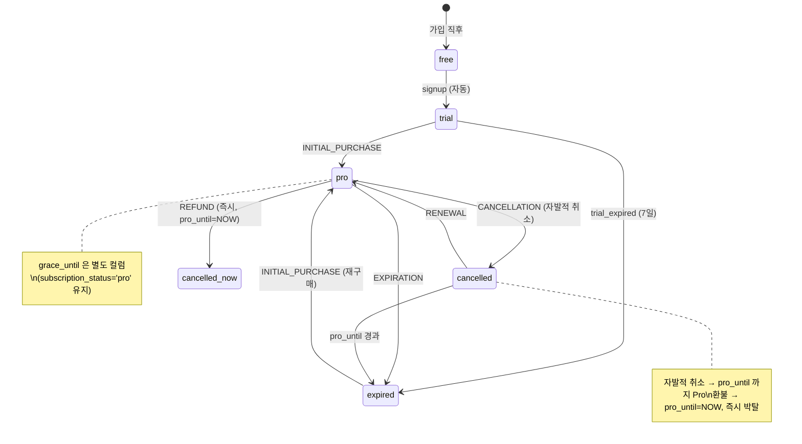

# 영수증 검증 흐름 — RevenueCat customer info 기반 이벤트 처리

## Summary

RevenueCat customer info 를 신뢰원으로 사용하는 영수증 검증 전략. backend 가 Apple/Google 영수증을 직접 검증하지 않고 RevenueCat 이 server-side 검증 완료한 customer info 를 신뢰. 모든 webhook 이벤트 처리 의사코드·보안·idempotency 명세.

---

## 1. 검증 전략

### 1-1. backend 는 RevenueCat customer info 를 신뢰

| 방식 | 설명 | Phase 2 채택 |
|------|------|:---:|
| backend 직접 Apple/Google 검증 | backend 가 Apple/Google Receipt Validation API 직접 호출 | ✗ |
| **RevenueCat customer info 신뢰** | RevenueCat 이 Apple/Google server-side 검증 완료 → customer info 발급 → backend 신뢰 | ✓ |

**Why**: RevenueCat 이 이미 Apple/Google 영수증을 server-side 에서 검증. backend 가 추가로 검증할 필요 없음. verify endpoint 에서는 RevenueCat API 를 한 번 더 조회해 위조 방어만 수행 (client 가 보낸 값을 그대로 신뢰하지 않음).

### 1-2. 위조 방어 (verify endpoint)

```
client → POST /verify (transaction_id, product_identifier)
backend → RevenueCat GET /subscribers/{app_user_id}
backend → entitlements.active 확인 → 없으면 422
backend → 갱신
```

client 가 transaction_id 를 위조해도 RevenueCat API 조회에서 entitlement 없음 → 거부.

---

## 2. 이벤트 처리 의사코드

### 2-1. webhook handler

```python
def handle_revenuecat_webhook(event: dict) -> dict:
    # 1. idempotency 체크 (event.id 기반)
    if subscription_events_repo.exists_by_event_id(event["id"]):
        return {"success": True, "data": {"idempotent": True}}

    # 2. 사용자 조회
    user = user_repo.find_by_id(event["app_user_id"])
    if not user:
        logger.warning(f"Webhook: unknown app_user_id {event['app_user_id']}")
        return {"success": True, "data": {"idempotent": False}}  # 재시도 방지

    event_type = event["type"]
    now_utc = datetime.utcnow()

    # 3. 이벤트 분기
    if event_type in ("INITIAL_PURCHASE", "RENEWAL"):
        user.subscription_status = "pro"
        user.pro_until = _parse_ms(event.get("expiration_at_ms"))
        user.grace_until = None
        sub_event_type = "purchased" if event_type == "INITIAL_PURCHASE" else "renewed"

    elif event_type == "CANCELLATION":
        # 자발적 취소: pro_until 까지 Pro 유지 (adr-21)
        user.subscription_status = "cancelled"
        # pro_until 변경 없음
        sub_event_type = "cancel_scheduled"

    elif event_type == "EXPIRATION":
        user.subscription_status = "expired"
        sub_event_type = "expired"

    elif event_type == "BILLING_ISSUE":
        # grace period: pro 유지 + grace_until 설정 (adr-19 B)
        # subscription_status = 'pro' 그대로 유지
        user.grace_until = _parse_ms(event.get("grace_period_expiration_at_ms"))
        sub_event_type = "billing_issue"

    elif event_type == "REFUND":
        # 환불: 즉시 cancelled + pro_until = now (adr-21)
        user.subscription_status = "cancelled"
        user.pro_until = now_utc
        user.grace_until = None
        sub_event_type = "refunded"

    else:
        # PRODUCT_CHANGE, SUBSCRIBER_ALIAS 등 — 무시
        logger.info(f"Unhandled event type: {event_type}")
        return {"success": True, "data": {"idempotent": False}}

    # 4. subscription_events INSERT
    sub_event = SubscriptionEvent(
        user_id=user.id,
        event_type=sub_event_type,
        source="revenuecat",
        plan="monthly",
        amount_cents=_extract_amount_cents(event),
        occurred_at=_parse_ms(event.get("purchased_at_ms")) or now_utc,
        raw_payload=event,
        event_id=event["id"],
        transaction_id=event.get("transaction_id"),
    )
    subscription_events_repo.add(sub_event)

    # 5. User 저장 (원자적 트랜잭션)
    user_repo.save(user)

    return {"success": True, "data": {"idempotent": False}}


def _parse_ms(ms: int | None) -> datetime | None:
    if ms is None:
        return None
    return datetime.utcfromtimestamp(ms / 1000)


def _extract_amount_cents(event: dict) -> int | None:
    # RevenueCat price 필드는 price_in_purchased_currency (예: 1.99)
    price = event.get("price")
    if price is not None:
        return int(round(float(price) * 100))
    return None
```

### 2-2. verify handler (구매 즉시 sync)

```python
def handle_verify(user_id: str, transaction_id: str, product_identifier: str) -> dict:
    # 1. idempotency 체크 (transaction_id 기반)
    if subscription_events_repo.exists_by_transaction_id(transaction_id):
        user = user_repo.find_by_id(user_id)
        return _build_response(user, idempotent=True)

    # 2. RevenueCat customer info 조회 (위조 방어)
    customer_info = revenuecat_client.get_subscriber(user_id)
    if not customer_info.entitlements_active:
        raise VerificationFailedError("no active entitlement")

    # 3. 상태 갱신 (INITIAL_PURCHASE 로직 동일)
    user = user_repo.find_by_id(user_id)
    user.subscription_status = "pro"
    user.pro_until = customer_info.entitlements_expiration_at
    user.grace_until = None

    sub_event = SubscriptionEvent(
        user_id=user_id,
        event_type="purchased",
        source="revenuecat",
        plan="monthly",
        amount_cents=199,
        transaction_id=transaction_id,
        raw_payload=customer_info.raw,
    )
    subscription_events_repo.add(sub_event)
    user_repo.save(user)

    return _build_response(user, idempotent=False)
```

---

## 3. Pro 기능 활성화 판단 (Phase 2)

```python
def is_active_pro(user: User) -> bool:
    now = datetime.utcnow()
    if user.subscription_status in ("trial", "pro"):
        return True
    if user.subscription_status == "cancelled" and user.pro_until and user.pro_until > now:
        return True
    return False

def is_grace_period(user: User) -> bool:
    """grace_until 존재 & 아직 경과 안 했으면 grace period"""
    if user.grace_until and user.grace_until > datetime.utcnow():
        return True
    return False
```

> Phase 1 `is_active_pro` 로직 그대로 유지. grace period 는 `subscription_status='pro'` 이므로 `is_active_pro` 에서 자동 포함.

---

## 4. 상태 전이 요약 (Phase 1 5-state 머신 + Phase 2 이벤트 매핑)



---

## 5. 보안 정책

### 5-1. webhook 인증 (adr-20)

- `Authorization: Bearer <REVENUECAT_WEBHOOK_AUTH_TOKEN>` 헤더 필수
- 불일치 시 401 — 토큰 유출 시 즉시 RevenueCat 대시보드에서 교체
- HTTPS 강제 (TLS 없으면 토큰 평문 노출)

### 5-2. verify 위조 방어

- client 가 보낸 transaction_id / product_identifier 를 그대로 신뢰하지 않음
- backend 가 RevenueCat GET /subscribers/{user_id} 호출 → entitlement 직접 확인

### 5-3. idempotency 보안

- 동일 event_id/transaction_id 로 복수 INSERT 불가 (DB UNIQUE INDEX)
- 중복 이벤트는 200 반환 (재시도 유도 방지)

### 5-4. rate limit (verify / sync)

- 동일 user_id 에서 verify 5회/분 초과 시 429
- sync 30초 쿨다운 (사용자 rapid-fire 방지)
- FastAPI dependency 또는 Redis 기반 sliding window 구현

---

## 6. Grace Period 처리 (adr-19 B 결정)

```python
# BILLING_ISSUE 수신 시
user.grace_until = event.grace_period_expiration_at  # Apple: 최대 16일 / Google: 최대 30일
# subscription_status = 'pro' 유지 (6번째 state 추가 없음)

# grace period 종료 후 갱신 성공 (RENEWAL)
user.grace_until = None
user.subscription_status = "pro"
user.pro_until = event.expiration_at

# grace period 종료 후 갱신 실패 (EXPIRATION)
user.grace_until = None
user.subscription_status = "expired"
```

---

## 7. 영향 범위

- **backend/api** ○: webhook/verify/sync handler 구현. User.grace_until 컬럼 추가. subscription_events event_id/transaction_id 컬럼 추가. RevenueCat client 모듈 (GET /subscribers) 추가.
- **frontend/mobile-fe** × (이 spec 은 backend 전용. mobile 은 spec-08 참조)
- **frontend/web-fe** ×
- **frontend/shared-fe** ×
